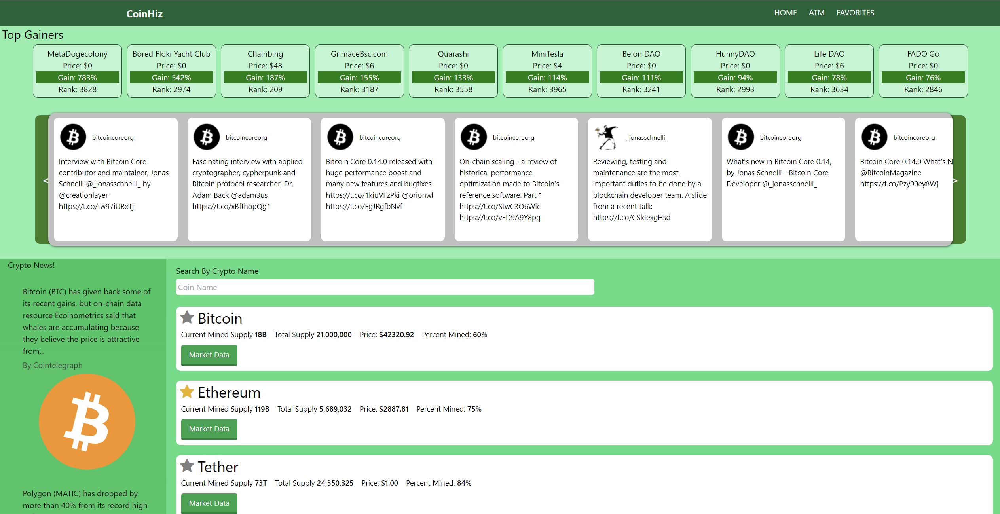

# CoinHiz 💰

## Purpose
A website for aggregating data on cryptocurrencies. Search coins, favorite coins, see crypto news and social media feeds, and find the nearest cryptocurrency ATM all in one easy-to-use website.

## Built With
* HTML
* CSS
* Javascript
* jQuery
* LocalStorage
* Chart.js
* Tailwind.css
* CoinLore API
* CoinPaprika API
* Google Maps API
* CrpytoPulse API
* CryptoCurrency-Markets API
* CryptoCompare API

## Website
https://johnnyboy7781.github.io/coinhiz/

## Contribution
Made with ❤️ by :
* Jonathan McDonnell
* Chris Waters
* Brady Stafford
* Douglas Knowles
* Garret Hilberling
* Raul Jimenez
